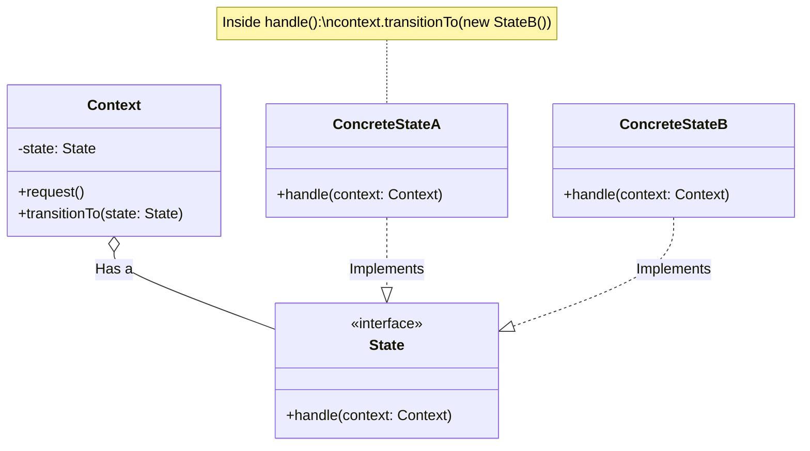

# The State Pattern: A Deep Dive

The **State Pattern** is a behavioral design pattern that allows an object to change its behavior when its internal state changes. The object will appear to change its class.

## The Core Problem
Imagine a **Vending Machine**.
- If it's `OUT_OF_STOCK`, pressing the button does nothing.
- If it's `READY`, pressing the button asks for money.
- If it's `HAS_MONEY`, pressing the button dispenses a soda.

### The "If-Else" Nightmare
Without the State pattern, your code looks like this:
```typescript
class VendingMachine {
    pressButton() {
        if (this.state === "OUT_OF_STOCK") {
            // ... logic
        } else if (this.state === "READY") {
            // ... logic
        } else if (this.state === "HAS_MONEY") {
            // ... logic
        }
    }
}
```
As you add more states (e.g., `MAINTENANCE`, `DISPENSING`), every single method (`pressButton`, `insertMoney`, `returnChange`) becomes a giant, unreadable mess of conditionals.

## The Solution: The State Object
Instead of the `VendingMachine` having all the logic, we move the logic into **State Objects**.
1. The **Context** (VendingMachine) keeps a reference to a `State` object.
2. The **Context** delegates work to the current state: `this.state.pressButton()`.
3. To change behavior, we just swap the `state` object: `this.state = new HasMoneyState()`.

## Visual Diagram



## State vs. Strategy
They look identical in code, but their **intent** is different:
- **Strategy**: You choose an algorithm once (e.g., "Pay with Credit Card"). Strategies usually don't know about each other.
- **State**: The states transition automatically as the object lives (e.g., "Draft" -> "Review" -> "Published"). States often trigger the transition to the next state.

## When to use it?
1. **Complex Workflows**: Documents, Order Processing, Game Characters (Idle -> Walk -> Attack).
2. **Boolean Hell**: When you have 5+ boolean flags (`isStarted`, `isFinished`, `isError`) that are hard to manage.
3. **Large Conditionals**: When a class has massive `switch` or `if/else` statements that depend on a "status" field.

```