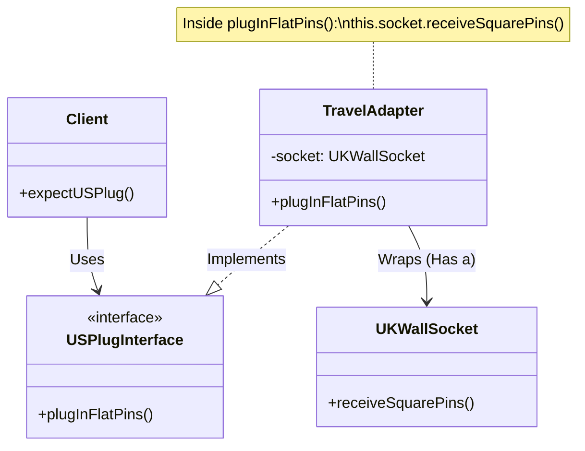

# The Adapter Pattern: A Deep Dive

The **Adapter Pattern** is a structural design pattern that allows objects with incompatible interfaces to collaborate.

## The Core Problem
Imagine you are at an airport.
- **YOU** (The Client) have a **US Plug** (The Interface you expect).
- The **WALL** (The Service) has a **UK Socket** (The Interface that exists).

You cannot plug your device in directly. You need a middleman.

## The Solution: The Wrapper
You buy a **Travel Adapter**.
1. It looks like a **UK Plug** on one side (fits into the wall).
2. It looks like a **US Socket** on the other side (you plug into it).

You (The Client) don't need to know how UK electricity works. You just plug into the US-shaped hole in the adapter. The adapter handles the weird pins.

## Visual Diagram

## The "Wrapper" Mental Model
The Adapter is often called a **Wrapper**. It "wraps" the incompatible object.

- **Input**: The method call YOU make (`adapter.makePayment(dollars)`)
- **Internal Translation**: The adapter does math/logic (`dollars * 100`)
- **Output**: The method call the SERVICE receives (`service.payInCents(cents)`)

## When to use it?
1. **Legacy Code**: You have an old system you can't change, but you want to use it in new code.
2. **3rd Party Libraries**: A library expects data in Format A, but you have Format B.
3. **Refactoring**: You want to switch vendors (e.g., Stripe to PayPal) without changing all your business logic. You just write a new Adapter.
