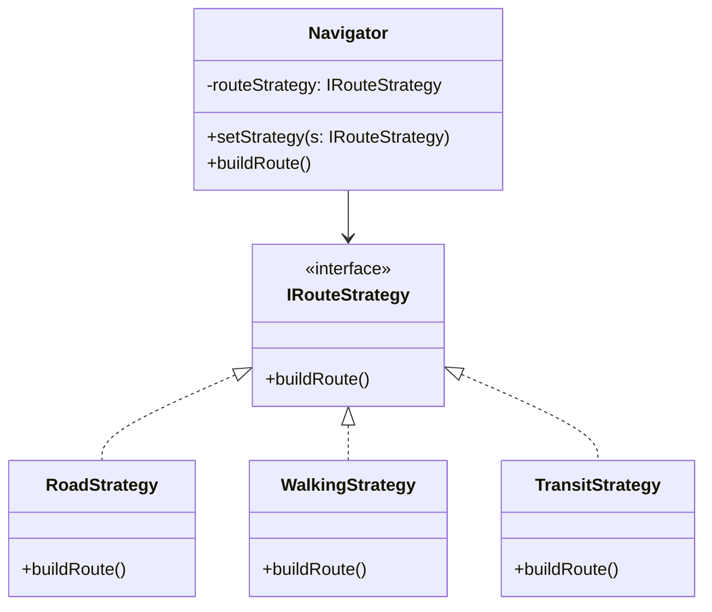

# The Strategy Pattern

**"The Chameleon Pattern"**

The Strategy Pattern is about **defining a family of algorithms**, encapsulating each one, and making them interchangeable. It lets the algorithm vary independently from clients that use it.

## 🛑 The Problem: The "Switch Statement of Doom"

You start with a simple class, but as requirements grow, you keep adding `if/else` or `switch` statements to handle different variations.

```typescript
class Navigator {
    buildRoute(transportMode: string) {
        if (transportMode === 'road') {
            // ... complex road logic ...
        } else if (transportMode === 'walking') {
            // ... complex walking logic ...
        } else if (transportMode === 'public_transit') {
            // ... complex bus/train logic ...
        }
    }
}
```

**Why this is bad:**
1.  **Violation of Open/Closed Principle**: To add 'cycling', you have to modify the `Navigator` class.
2.  **Giant File**: This class will eventually become 5000 lines long.
3.  **Hard to Test**: You have to test every transport mode inside one file.

---

## 🟢 The Solution: Strategy Pattern

Take each "branch" of logic and move it into its own class.



### Key Benefits
1.  **Encapsulation**: Road logic lives in `RoadStrategy`. Walking logic lives in `WalkingStrategy`.
2.  **Interchangeable**: `navigator.setStrategy(new CyclingStrategy())` works instantly at runtime.
3.  **Clean Context**: The `Navigator` context class becomes tiny and just delegating work.

---

## 🧠 Mental Model: The Game Console

Think of the **Context** (your app) like a **Nintendo Switch**. 
Think of the **Strategies** like **Game Cartridges**.

*   The Console (Context) knows how to run a game.
*   The Cartridge (Strategy) contains the actual game logic (Mario, Zelda, Pokemon).
*   You can swap cartridges while the console is running. The console doesn't care which game is in it, it just plays it.
