# Level 10, Project 1: The Bottleneck (System Design) 🏭

## The Scenario
You are designing a data ingestion system for thousands of IoT sensors. They send temperature data continuously.

## The Problem
The current system processes every message synchronously as it arrives. During traffic spikes, the database locks up, and the server crashes.

## Your Goal
Implement a **Producer-Consumer Pipeline** with a buffer (queue) and a rate-limited processor.

## Decision Tree & Logic Flow

### 1. Data Pipeline Architecture (Flowchart)

### 2. Processing Logic (Decision Tree)
When a new message arrives at the Ingestion API:

```mermaid
graph TD
    Arrive[Data Arrives] --> Validate{Is Format Valid?}
    Validate -- No --> Reject[❌ Drop / Log Error]
    Validate -- Yes --> CheckQueue{Is Queue Full?}
    
    CheckQueue -- Yes --> Backpressure{Backpressure Policy?}
    Backpressure -- "Drop Oldest" --> DropOld[🗑️ Drop Oldest Item] --> Enqueue
    Backpressure -- "Reject New" --> RejectBusy[⛔ Return 503 Busy]
    
    CheckQueue -- No --> Enqueue[📥 Add to Queue]
    Enqueue --> WorkerProcess[Worker Picks Up]
```

## Setup
Work in `src/pipeline.ts`. Simulate the `Queue` and `Worker` classes.
