# Level 11, Project 1: The Chaos Engine (Debugging & Resilience) 🐞

## The Scenario
You maintain a "Reliable Notification Service". However, it's currently anything but reliable. It crashes randomly, hangs indefinitely, and loses messages.

## The Problem
The code in `src/chaos-service.ts` simulates a flaky external API. Your `NotificationSender` calls this service blindly.
1.  **Random Failures:** The external service throws random errors.
2.  **Timeouts:** Sometimes requests hang forever.
3.  **No Retry Logic:** Failed messages are lost.

## Your Goal
Fix the `NotificationSender` to be resilient.

## Decision Tree & Logic Flow

### 1. Resilience Strategy (Flowchart)
How to handle a request:

```mermaid
graph TD
    Start[Send Request] --> Call{Call External API}
    Call -- Success --> Done([✅ Success])
    Call -- Timeout --> RetryCheck{Retry Left?}
    Call -- Error 500 --> RetryCheck
    
    RetryCheck -- Yes --> Wait[⏳ Backoff Wait]
    Wait --> Call
    
    RetryCheck -- No --> CircuitBreak{Failure Threshold Hit?}
    CircuitBreak -- Yes --> OpenCircuit[🔌 Open Circuit Breaker]
    OpenCircuit --> Fallback[⚠️ Use Fallback / Log]
```

## Setup
Work in `src/resilience.ts`. Wrap the flaky `ChaosService` with retries and a simple circuit breaker.
