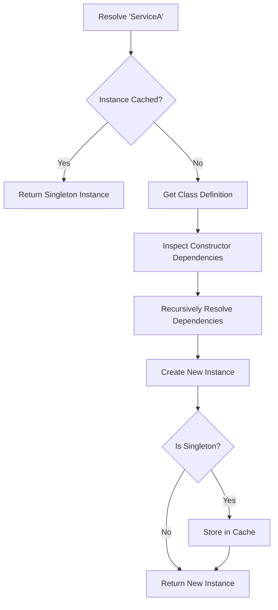

# Level 13, Project 1: The Magic Container (Dependency Injection) 🧙‍♂️

## The Scenario
Your application has hundreds of classes (`ServiceA`, `ServiceB`, `Database`, `Logger`). Wiring them up manually (`new ServiceA(new ServiceB(new Database...))`) is tedious and error-prone.

## The Problem
You want to invert control. Instead of classes asking for dependencies or creating them, a central "Container" should provide them.

## Your Goal
Implement a basic **Dependency Injection (DI) Container**.

## Decision Tree & Logic Flow

### 1. Resolution Logic (Flowchart)
When `container.resolve('ServiceA')` is called:

## Setup
Work in `src/di.ts`.
