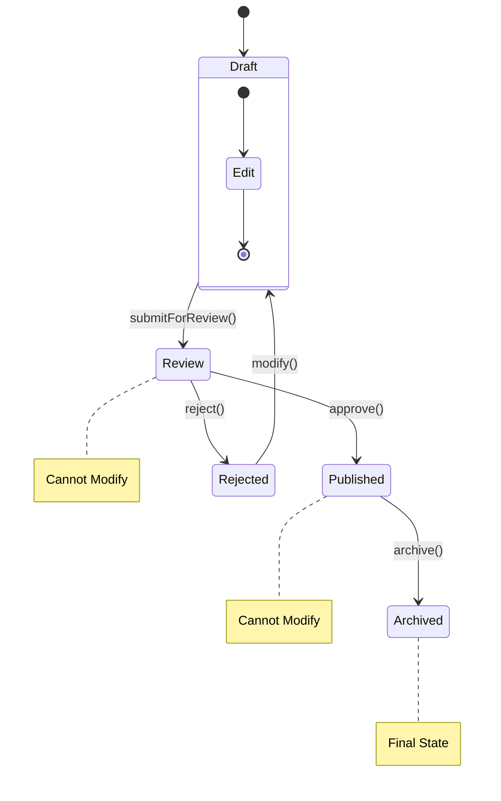
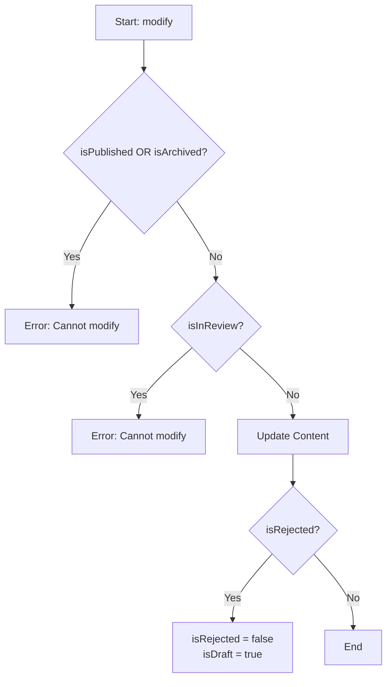
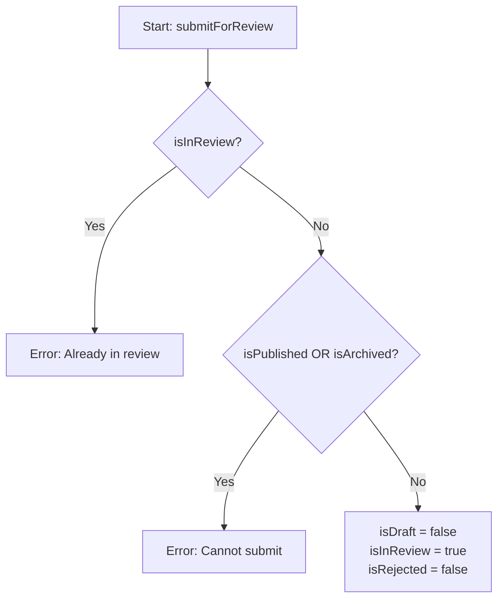
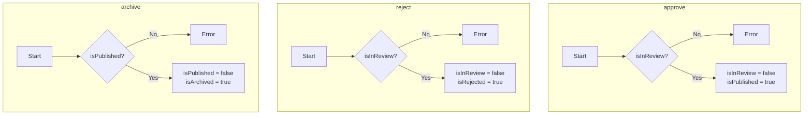

# Level 7, Project 1: The Boolean State Hell

## The Scenario

You are building a Content Management System (CMS) for a publishing house. The core entity is a `Document`. A document goes through a strict workflow:
`Draft` -> `Review` -> `Published`.

It can also be `Rejected` (from Review) or `Archived` (from Published).

## The Problem

The `Document` class in `src/document.ts` manages its state using a collection of boolean flags: `isDraft`, `isInReview`, `isPublished`, `isArchived`, etc.

The logic in methods like `submitForReview()`, `approve()`, and `reject()` is a tangled mess of `if/else` checks to ensure valid transitions (e.g., you can't archive a document that is in draft).

This approach is:
1.  **Bug-prone:** It's easy to accidentally set two flags to true (e.g., `isDraft = true` AND `isPublished = true`).
2.  **Hard to extend:** Adding a "Scheduled" state would require checking every other flag in every method.
3.  **Hard to read:** The business rules are buried in conditional logic.

## Your Goal

Refactor the `Document` class to use the **State Pattern**.

**Key Requirements:**
1.  Define a `State` interface (or abstract class) with methods for each transition (e.g., `publish()`, `reject()`).
2.  Create concrete state classes: `DraftState`, `ReviewState`, `PublishedState`, etc.
3.  The `Document` class should delegate behavior to its current state object.
4.  Remove all boolean state flags (`isDraft`, etc.) from the `Document` class.

## Current State Visualization

Here is the state machine diagram and decision logic of the current messy implementation.

### 1. State Transition Diagram (The "Happy Path" & Valid Flows)

This diagram shows how the document *should* move between states.

### 2. Decision Logic Tree (The "Messy" Reality)

This represents the current `if/else` logic implemented in the class.

#### `modify(content)`

#### `submitForReview()`

#### `approve()`, `reject()`, `archive()`

