# Level 8, Project 1: The Lost Robot (Pathfinding) 🤖

## The Scenario
You control a robot in a warehouse grid. The robot needs to navigate from a **Start Point (S)** to a **Target Point (T)**. The grid contains **Walls (#)** that block the path.

## The Problem
The current robot moves randomly or gets stuck in loops. It doesn't know how to find the shortest path.

## Your Goal
Implement a pathfinding algorithm (BFS, Dijkstra, or A*) to guide the robot efficiently.

## Decision Tree & Logic Flow

### 1. Navigation Logic (Flowchart)
How the robot decides to move:

### 2. Next Step Decision (Decision Tree)
When evaluating a neighbor cell (UP, DOWN, LEFT, RIGHT):

```mermaid
graph TD
    Evaluate[Evaluate Neighbor Cell]
    Evaluate --> IsOutOfBounds{Is Out of Bounds?}
    IsOutOfBounds -- Yes --> Invalid[❌ Invalid Move]
    IsOutOfBounds -- No --> IsWall{Is it a Wall #?}
    
    IsWall -- Yes --> Invalid
    IsWall -- No --> IsVisited{Is in Visited Set?}
    
    IsVisited -- Yes --> Invalid
    IsVisited -- No --> Valid[✅ Valid Move]
```

## Setup
Work in `src/grid.ts`. Use the `Grid` class to represent the map and implement the `findPath(start, end)` method.
