# Level 9, Project 1: The Leaky Pool (Resource Management) 💧

## The Scenario
Your application manages expensive database connections. Creating a new connection for every request is too slow, but keeping them all open runs out of memory.

## The Problem
Currently, connections are created ad-hoc (`new Connection()`) and often not closed properly, leading to memory leaks and "Too Many Connections" errors.

## Your Goal
Implement a **Resource Pool (Object Pool)** pattern.

## Decision Tree & Logic Flow

### 1. Resource Lifecycle (Flowchart)
The lifecycle of a managed resource:

### 2. Acquisition Logic (Decision Tree)
When a client requests a resource:

```mermaid
graph TD
    Request[Client Requests Resource] --> IsPoolEmpty{Is Pool Empty?}
    
    IsPoolEmpty -- No --> Reuse[♻️ Reuse Idle Resource]
    IsPoolEmpty -- Yes --> CanGrow{Can Pool Grow?}
    
    CanGrow -- Yes --> Create[✨ Create New Resource]
    CanGrow -- No --> WaitForFree{Wait for Release?}
    
    WaitForFree -- Yes --> Queue[🕒 Add to Waiting Queue]
    WaitForFree -- No --> Error[❌ Throw Error: Pool Exhausted]
```

## Setup
Work in `src/pool.ts`. Implement the `ConnectionPool` class to manage `Connection` objects.
