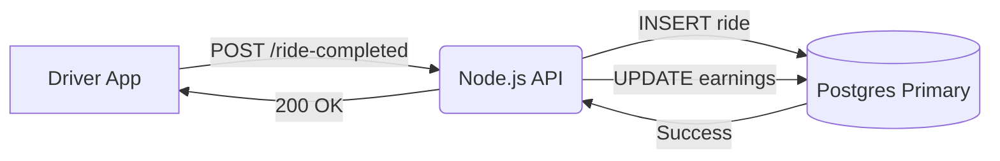

# Simulation: The "Simple" POST Endpoint

## Context
We are building a notification service for a ride-sharing app. When a ride completes, the driver's phone sends a `POST /ride-completed` request containing ride details (distance, fare, duration, route points). This triggers an email receipt and updates the driver's daily earnings.

## STEP 1 – Initial Design

The team wanted to keep it simple (KISS principle) and avoid "premature optimization".

### Architecture
1.  **Client (Driver App)** sends JSON payload to API.
2.  **API Server (Node.js/Express)** validates the payload.
3.  **Synchronous DB Write:** API inserts the ride record into the `rides` table in PostgreSQL.
4.  **Synchronous DB Update:** API updates the `driver_earnings` table (increment balance).
5.  **Response:** API returns `200 OK` to the client.

**Flowchart:**

### Tech Stack
*   **Runtime:** Node.js (Single threaded event loop)
*   **Database:** PostgreSQL 14 (Single instance, 4 vCPUs, 16GB RAM, SSD)
*   **ORM:** TypeORM
*   **Infrastructure:** 2 API instances behind a Load Balancer.

### Traffic Assumptions (At Launch)
*   **Daily Rides:** ~10,000 rides/day.
*   **Peak Traffic:** ~5 rides/sec.
*   **Payload Size:** ~2KB (mostly GPS points).

### "Why the team thought this was fine"
*   **ACID Guarantees:** Updating the ride and earnings in a single transaction ensures data consistency. If one fails, both roll back.
*   **Simplicity:** No extra infrastructure (Redis/Kafka) to manage. Less operational overhead.
*   **Latency:** Postgres inserts are fast (sub-millisecond typically). The whole request takes ~50ms.

---

## The Shift
Six months later, the business grew. We just launched a marketing campaign.
*   **Daily Rides:** ~100,000 rides/day (10x growth).
*   **Peak Traffic:** 200 rides/sec (spikey).
*   **New Requirement:** We also need to send an email receipt, so the team added a synchronous call to a 3rd party Email API (SendGrid/SES) *inside* the request handler before sending the response, to "ensure the user gets the email".

**Now p95 latency is hitting 3 seconds. Timeouts are occurring.**
