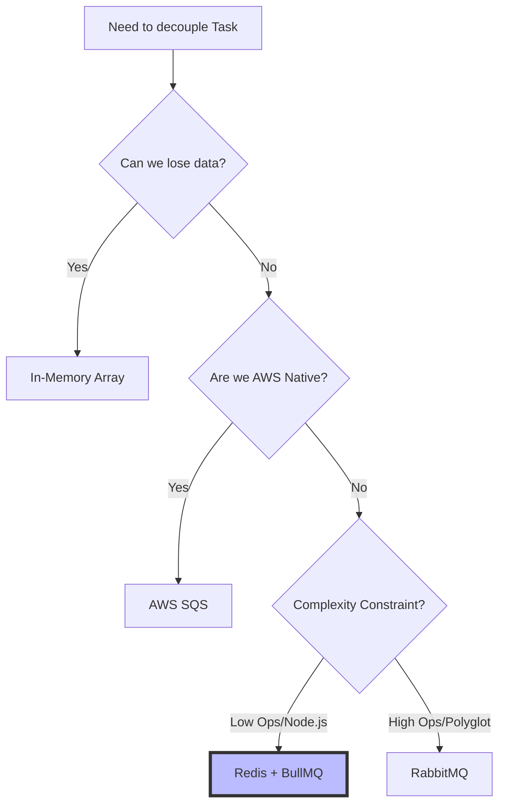
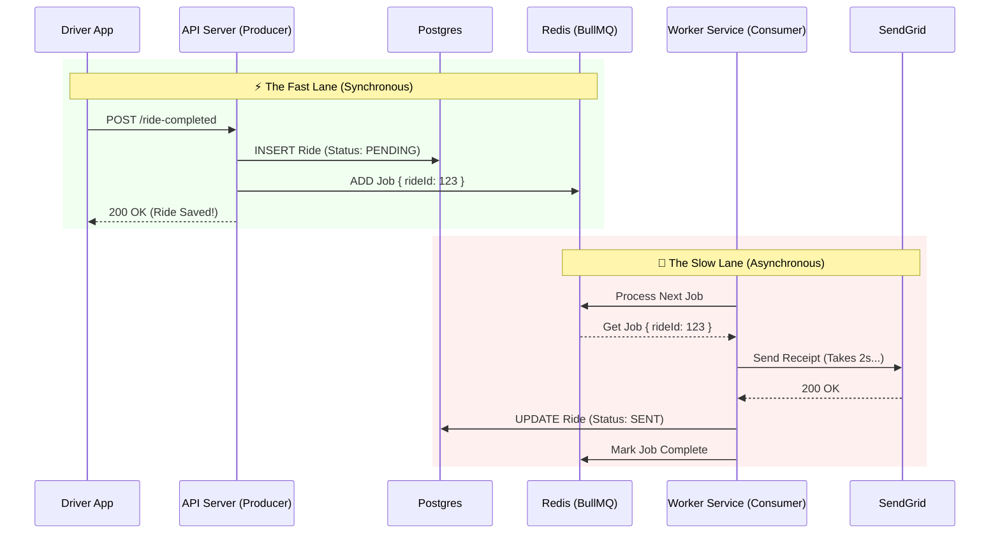

# Solution: The Async Worker Pattern

## 1. The Decision Tree: "Which Queue?"

We needed to move the slow Email API call out of the critical request path. Here is how we selected the technology stack.

**Verdict:** We chose **Redis + BullMQ**.
*   **Why:** It fits naturally into the Node.js ecosystem, supports retries/delays out of the box, and is easier to manage than RabbitMQ for our scale (200 RPS).

---

## 2. The New Architecture

We separate the system into two distinct parts: the **Producer** (Fast API) and the **Consumer** (Slow Worker).

### The Flow
1.  **Driver** hits API.
2.  **API** saves to DB and pushes a Job ID to Redis. Responds immediately (50ms).
3.  **Worker** (running in background) picks up Job.
4.  **Worker** calls SendGrid. If it fails, it retries automatically.

---

## 3. Key Benefits

1.  **Latnecy Drop:** p95 goes from **3s -> 50ms**.
2.  **Resilience:** If SendGrid goes down, we don't lose emails. They just pile up in Redis and get processed when SendGrid is back.
3.  **Scalability:** We can scale the API (to handle more requests) separately from the Workers (to handle more emails). If the queue grows too large, we just boot up more Worker instances.
