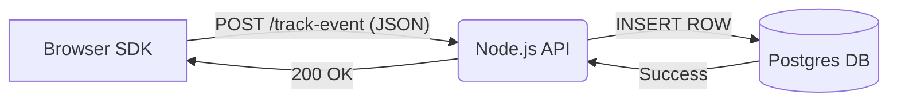

# Case Study 2: The Analytics "Firehose"

## STEP 1 – Initial Design

### The Context
We are building the **"Live View" Analytics Service** for a large e-commerce platform.
Every time a user clicks a product, scrolls a page, or adds an item to a cart, the frontend sends a fire-and-forget event.

**Endpoint:** `POST /track-event`
**Payload:**
```json
{
  "userId": "u-12345",
  "eventType": "PRODUCT_VIEW",
  "timestamp": 1678888888,
  "metadata": { "sku": "ABC-99", "source": "promo_banner" }
}
```

### The Architecture (Launch Day)
The team wanted to keep it simple. Why introduce Kafka if Postgres is sitting right there?

1.  **Client:** Javascript SDK sends `POST` request.
2.  **API:** Node.js (Express).
3.  **Database:** PostgreSQL. Simple `INSERT INTO events (...)` query.



### Tech Stack
*   **App:** Node.js / Express (Stateless, 5 instances).
*   **DB:** PostgreSQL 14 (Standard Cloud Instance: 4 vCPU, 16GB RAM).
*   **Connection Pooling:** `pg-pool` with default settings (max 10 connections per instance).

### Traffic Assumptions (At Launch)
*   **Traffic:** 500 requests/sec (RPS).
*   **Data Volume:** ~1KB per event.
*   **Pattern:** Constant stream, higher during day, lower at night.

### "Why the team thought this was fine"
1.  **"Postgres is Fast":** Benchmarks show Postgres can handle 10,000+ simple INSERTS per second on this hardware. We are only doing 500.
2.  **No Complex Ops:** No Kafka to manage, no Redis to pay for. Just a table.
3.  **Data Integrity:** "ACID compliant! We won't lose analytics data."

---

## 🚨 The Incident: "Success Disaster"

It is **Black Friday**. Traffic didn't just double; it went **10x**.

*   **Current Traffic:** 5,000 requests/sec.
*   **Symptom:** The API is timing out. p95 latency has jumped from **20ms** to **4 seconds**.
*   **The Database CPU:** hovering around 40% (Not maxed out! Weird, right?).
*   **The App Logs:** Full of `Error: timeout exceeded` and `Connection terminated`.

### The Team Debate
The engineers are panic-huddled in a Slack channel. They have 4 proposals on the whiteboard:

1.  **Option A (Direct DB):** "Just upgrade the Postgres instance to a huge 64-core machine! It handles writes, right?"
2.  **Option B (In-Memory Buffer):** "Store events in a Javascript array `[]` in the API memory, and bulk-insert them every 5 seconds."
3.  **Option C (Redis List):** "Push to Redis `LPUSH`, then have a worker `BRPOP` and save to DB."
4.  **Option D (RabbitMQ/Kafka):** "We need a real message broker."

### Your Turn
**What is happening right now?**
Why is latency exploding if DB CPU is only 40%?
Which Option (A, B, C, or D) do you choose to fix the fire *right now* vs *long term*?
