# The Evolution of Architecture: 500 to 50,000 RPS

This document visualizes how the system architecture must physically change as traffic grows by orders of magnitude.

## 🌳 The Decision Tree

How do we know when to upgrade? Follow the bottlenecks.

```mermaid
graph TD
    Start[🚀 Launch Day] --> Check1{Traffic < 500 RPS?}
    
    Check1 -- Yes --> Stage1["<b>Stage 1: The Monolith</b><br/>Simple Node.js + Postgres"]
    Check1 -- No --> Check2{Traffic < 5,000 RPS?}
    
    Check2 -- Yes --> bottleneck1(Bottleneck: DB Connection Limit)
    bottleneck1 --> Stage2["<b>Stage 2: The Decoupled Buffer</b><br/>Node.js + Redis + Worker + Postgres"]
    
    Check2 -- No --> Check3{Traffic < 50,000 RPS?}
    
    Check3 -- Yes --> bottleneck2(Bottleneck: Postgres Disk Space & Analytics Speed)
    bottleneck2 --> Stage3["<b>Stage 3: The Big Data Pipeline</b><br/>Kafka + ClickHouse/Data Lake"]
```

---

## 🏗️ Stage 1: The "Startup" (0 - 500 RPS)
**Goal:** Speed to market. Keep it simple.
**Bottleneck:** None yet. DB can handle direct inserts.

```mermaid
graph TB
    subgraph VPC [☁️ AWS VPC]
        subgraph Public
            LB[Load Balancer]
        end
        
        subgraph Private_App_Layer [Instance Type: t3.medium]
            API["Node.js Monolith<br/>(API + Logic)"]
        end
        
        subgraph Private_Data_Layer [Instance Type: db.t3.medium]
            DB[(Postgres)]
        end
    end
    
    LB --> API
    API -- Direct INSERT --> DB
```

---

## 🏗️ Stage 2: The "Scale-Up" (500 - 5,000 RPS)
**Goal:** Survival. Stop dropping requests.
**Bottleneck:** Postgres Connection Pool & Write Latency.
**Solution:** Introduce **Redis** to absorb spikes and **Workers** to batch writes.

```mermaid
graph TB
    subgraph VPC [☁️ AWS VPC]
        subgraph Public
            LB[Load Balancer]
        end
        
        subgraph Private_API_Layer [Instance: c5.large x 5]
            API1[API Server]
            API2[API Server]
        end
        
        subgraph Private_Buffer_Layer [Instance: r5.large]
            Redis[(Redis Queue)]
        end

        subgraph Private_Worker_Layer [Instance: c5.medium x 2]
            W1[Worker]
            W2[Worker]
        end
        
        subgraph Private_Data_Layer [Instance: db.m5.xlarge]
            DB[(Postgres)]
        end
    end
    
    LB --> API1 & API2
    API1 & API2 -- 1. Fast Push --> Redis
    Redis -- 2. Pull Batch --> W1 & W2
    W1 & W2 -- 3. Bulk Insert --> DB
```

---

## 🏗️ Stage 3: The "Unicorn" (50,000+ RPS)
**Goal:** Analytics at scale.
**Bottleneck:** 
1.  **Redis RAM:** Redis RAM is expensive. If workers die, Redis fills up in seconds and crashes.
2.  **Postgres Storage:** 50k events/sec = **4 Terabytes/day**. Postgres will choke on disk space and queries will take hours.
**Solution:** 
1.  Replace Redis with **Kafka** (Stores data on disk, can hold days of buffer).
2.  Replace Postgres with **ClickHouse/Snowflake** (Columnar DB designed for Trillions of rows).

### Key Changes at Stage 3
1.  **Redis -> Kafka:** Redis stores in RAM (volatile/expensive). Kafka stores on Disk (persistent/cheap). At 50k RPS, you need the safety of Disk.
2.  **Postgres -> ClickHouse:** Postgres is row-based (slow for analytics queries). ClickHouse is column-based (instant analytics on billions of rows).
3.  **Node.js -> Go/Rust:** Optional, but at 50k RPS, the GC pauses in Node.js might become annoying. Many teams rewrite the *ingestion* layer in Go/Rust to save compute costs.
