# Case Study 3: The "Infinite" Cache

## 🌳 The Decision Tree: "Where should my cache live?"

When designing a cache, you must navigate this flowchart. The team made the wrong turn at step 1.

```mermaid
graph TD
    Start[🚀 Need to Cache Data] --> Q1{Is the Dataset Bounded?}
    
    Q1 -- Yes --> Local["Option A: Local Memory (Fastest)"]
    Q1 -- No --> Q2{Is Latency Critical?}
    
    Q2 -- Yes --> Hybrid["Option B: Hybrid L1/L2 (Local + Redis)"]
    Q2 -- No --> Distributed["Option C: Distributed Cache (Redis / Memcached)"]
    
    style Local fill:#ffcccc,stroke:#333,stroke-width:2px
    style Distributed fill:#ccffcc,stroke:#333,stroke-width:2px
```



## STEP 1 – Initial Design

### The Context
We are building a **Product Pricing Service** for a high-traffic e-commerce site.
Pricing is complex and CPU intensive. It involves checking:
1.  Base price (DB)
2.  Seasonal discounts (DB)
3.  User loyalty tier (User Service)
4.  Competitor pricing (External API)

Calculating the final price takes **~400ms**. To make the site feel fast, we must cache this aggressively.

### The Architecture (Launch Day)
The team decided to optimize for **speed** and **simplicity**, effectively choosing **Option A (Local Memory)**.

1.  **Language:** Go (Golang).
2.  **Deployment:** Kubernetes, 3 Pods (4GB RAM each).
3.  **Caching Strategy:** In-Memory Cache (local map in Go).
4.  **Cache Key:** `product_id`.
5.  **Assumption:** Catalog size is 50,000 products. This fits easily in RAM.

### The Code (Simplified)
```go
// The "Simple" Local Cache
var priceCache = make(map[string]float64)
var mutex = &sync.RWMutex{}

func GetPrice(productID string) float64 {
    mutex.RLock()
    val, exists := priceCache[productID]
    mutex.RUnlock()

    if exists {
        return val
    }

    price := calculateComplexPrice(productID) // Expensive: 400ms
    
    mutex.Lock()
    priceCache[productID] = price
    mutex.Unlock()
    
    return price
}
```

### "Why the team thought this was fine"
1.  **Low Memory Footprint:** 50k products * 8 bytes = ~400KB. Even with overhead, it's negligible.
2.  **Zero Latency:** No network hop to Redis.
3.  **No Dependencies:** One less piece of infrastructure to manage.

---

## 🚨 The Incident: "Memory Leak?"

**Timeline:**
*   **Day 1:** Works perfectly. 99th percentile latency is < 1ms.
*   **Day 7 (Marketing Campaign):** We launch **Personalized Pricing**.
    *   **New Requirement:** Price now depends on `product_id` AND `user_id` AND `coupon_code`.
    *   **The Change:** Developers update the cache key to handle uniqueness.
    *   `key := fmt.Sprintf("%s:%s:%s", productID, userID, couponCode)`

### 💥 The Failure Flow

```mermaid
graph TD
    User[User Request] -- "GET Price(User A, Prod 1)" --> API[API Pod 1]
    API -- "Calculates Price" --> Cache[(Local Map)]
    Cache -- "Stores key: 'prod1:userA'" --> Memory[RAM Usage]
    
    User2[User Request 2] -- "GET Price(User B, Prod 1)" --> API
    API -- "Calculates Price" --> Cache
    Cache -- "Stores key: 'prod1:userB'" --> Memory
    
    subgraph "Inside the Pod Memory"
    Memory -- "Key count: 100" --> OK[Green]
    Memory -- "Key count: 1,000,000" --> Warning[Orange]
    Memory -- "Key count: 50,000,000" --> Danger[Red: 4GB Limit]
    Danger -- "OOM Signal" --> Crash((💥 KILL SIGNAL))
    end
```



*   **Day 7, 16:00 (2 hours later):**
    *   **Alert:** Pods are entering `CrashLoopBackOff`. OOM Killed (Out of Memory).
    *   **Latency:** Spikes to 2 seconds (because pods are restarting and cold caches are missing).

### The Metrics
*   **Memory Usage:** Steadily climbing from 200MB -> 2GB -> 4GB (Limit) -> Crash.
*   **Restart Loop:** Every ~30 minutes, a pod dies and restarts.

### The Debugging Session
The engineers look at the dashboard.
"We have 12GB of total RAM across 3 pods! Why are we running out? It's just text keys!"

**What went wrong?**
1.  **Cardinality Explosion:** 50k Products * 1M Users * 10 Coupons = **500 Billion possible keys**.
2.  **No Eviction Policy:** The Go `map` grows indefinitely. It never deletes old entries.
3.  **Local State:** Caches are duplicated across pods, wasting RAM (Redundant storage).
