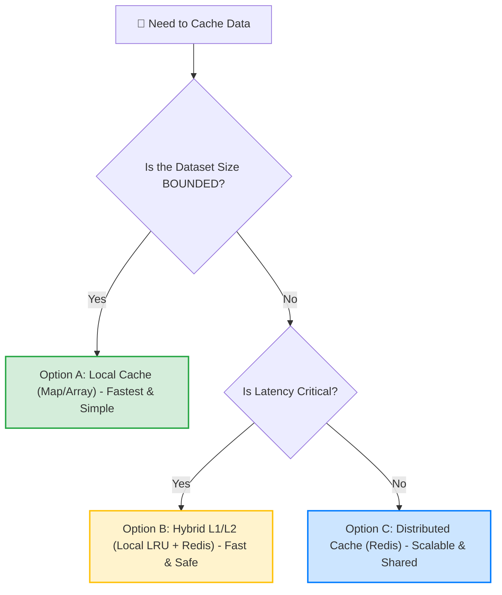

# Solution: Taming the Infinite Cache

## 1. The Decision Tree: "How to Avoid the OOM Crash"

Use this flowchart to choose the right caching strategy and avoid running out of memory.



### 🛑 Critical Rule: The "Bounded" Check
*   **Bounded:** The set of keys is finite and small (e.g., "List of US States"). It will never grow to millions. -> **Safe for Local Map**.
*   **Unbounded:** The set of keys grows with user traffic (e.g., `UserID`, `SessionID`, `OrderHistory`). -> **NEVER use a naked Map. Use LRU or Redis.**

---

## 2. The Fixes (Ranked)

### Fix 1: The Quick Patch (Stop the Bleeding)
**Goal:** Stop OOM crashes immediately without setting up new infrastructure.
**Strategy:** **Bounded Local Cache (LRU)**.
**Action:** Replace the standard Go `map` with an **LRU Cache** (Least Recently Used) library.

**Code Change:**
```go
// BEFORE: Unsafe (Grows forever)
// var priceCache = make(map[string]float64)

// AFTER: Safe (Hard limit of 10,000 items)
import "github.com/hashicorp/golang-lru"

cache, _ := lru.New(10000) // Allocates fixed memory (~20MB)

func GetPrice(key string) float64 {
    if val, ok := cache.Get(key); ok {
        return val.(float64) // Cache Hit
    }
    // ... calculate ...
    cache.Add(key, price) // Automatically removes oldest item if full
}
```
**Why this fixes OOM:** The memory usage is capped. Even if 1 billion users hit the site, we only store the *last* 10,000 active ones.

### Fix 2: The Robust Architecture (Distributed Cache)
**Goal:** Consistent pricing across all pods and shared memory.
**Strategy:** **Redis (Remote Dictionary Server)**.
**Action:** Move the cache state out of the App Pods and into a dedicated Redis Cluster.

**Architecture:**
1.  **App Pods** become stateless.
2.  **Redis** holds the 50 million keys.
3.  **TTL (Time To Live):** We set `EXPIRE 600` (10 mins) on every key so Redis cleans itself up.

**Trade-off:** Latency increases from **0.001ms** (Local) to **2-5ms** (Network), but we gain infinite scalability.

### Fix 3: The Performance Optimization (Hybrid L1/L2)
**Goal:** Best of both worlds (Speed + Safety).
**Strategy:**
*   **L1 (Local):** Tiny LRU (Size: 500) for the "Super Hot" items (e.g., the homepage hero product).
*   **L2 (Redis):** Huge capacity for the "Long Tail" items.

---

## 3. Trade-Off Table

| Strategy | Memory Risk (OOM) | Latency | Consistency | Cost |
| :--- | :--- | :--- | :--- | :--- |
| **Naked Map (Original)** | **Critical** (Crash inevitable) | < 0.1ms | Poor (Local only) | Low |
| **Local LRU (Patch)** | **Safe** (Bounded Size) | < 0.1ms | Poor (Local only) | Low |
| **Redis (Distributed)** | **Safe** (Managed Externally) | 2-5ms | **Strong** (Shared) | Medium ($) |
| **Hybrid (L1+L2)** | **Safe** | < 0.1ms (Hot) | Eventual | Medium |

## 4. Key Takeaways for the Engineer
1.  **Never trust a `map` as a cache.** It has no eviction policy. It is a memory leak waiting to happen.
2.  **Cardinality Matters.** Just adding one ID to a key key can turn a KB-sized problem into a GB-sized problem.
3.  **Local State is hard.** In a distributed system (Kubernetes), local caches lead to "Split Brain" scenarios where users see different data on refresh.
