# Case Study 4: The Wildcard Outage

## STEP 1 – Initial Design

### The Context
We are running a high-scale **Auth Service**.
The `users` table contains **50 Million rows**.
The primary operation is looking up a user by email for login.

### Tech Stack
*   **Database:** PostgreSQL 15 (Large Instance: 16 vCPU, 64GB RAM).
*   **Query:** `SELECT * FROM users WHERE email = $1;`
*   **Index:** `CREATE UNIQUE INDEX idx_users_email ON users(email);` (B-Tree).

### Traffic Assumptions
*   **Logins:** 5,000 RPS.
*   **Latency:** 2ms per query.

### "Why the team thought this was fine"
B-Tree indexes are perfect for equality lookups. The index fits in memory (RAM), and logins are lightning-fast.

---

## 🚨 The Incident: "The Wildcard Trap"

**The Trigger:**
Marketing needs a report of all users from `@competitor.com`. An Admin panel feature is added:
`SELECT * FROM users WHERE email LIKE '%@competitor.com';`

**Timeline:**
*   **T+0:** Admin runs the search.
*   **T+5s:** Database CPU jumps from 15% to **100%**.
*   **T+10s:** Login latency spikes to **30 seconds**.
*   **T+15s:** **Site is Down.** All 5,000 RPS are failing as the connection pool is exhausted.

### 💥 The Failure Flow

```mermaid
graph TD
    Admin[Admin Panel] -- "LIKE '%@domain.com'" --> DB[Postgres]
    DB -- "B-Tree Index Check" --> BTree{Can I use Index?}
    BTree -- "No (Leading Wildcard)" --> Scan[<b>FULL TABLE SCAN</b>]
    Scan -- "Reading 50M Rows from Disk" --> CPU[CPU 100% / Disk I/O Maxed]
    
    User[User Login] -- "email = 'user@a.com'" --> DB
    DB -- "Waiting for CPU/Disk..." --> Queue[Request Queue]
    Queue -- "Timeout" --> Fail((❌ Site Outage))
    
    style Scan fill:#ffcccc,stroke:#333,stroke-width:2px
```

### The Metrics
*   **DB CPU:** 100% (Steady).
*   **Disk Read Ops:** Spiked to maximum IOPS.
*   **Active Queries:** All "Login" queries are in `waiting` state.
