# Case Study 5: The Thundering Herd (Cache Stampede)

## STEP 1 – Initial Design

### The Context
We are building a high-traffic **News Portal** (100,000 Requests per Second).
The homepage content is identical for all users and updates every hour.

### Tech Stack
*   **App:** Node.js / TypeScript.
*   **Database:** PostgreSQL (Complex queries for top stories).
*   **Cache:** Redis (Shared cluster).
*   **Strategy:** Cache-Aside.

### 💥 The Failure Flow

```mermaid
graph TD
    Users[100k Requests / sec] -- "1. GET /homepage" --> App[Node.js App]
    
    subgraph "T=09:00:00 (Cache Expires)"
    App -- "2. Check Redis" --> Redis{Redis}
    Redis -- "MISS (Key Expired)" --> App
    end
    
    subgraph "The Stampede"
    App -- "3. 100k Concurrent DB Calls" --> DB[(Postgres DB)]
    DB -- "4. Connection Pool Exhausted" --> Crash((💥 DB CRASH))
    end
    
    style DB fill:#ff6666,stroke:#333,stroke-width:2px
```



### The Flawed Code (TypeScript)
```typescript
async function getHomepage() {
    // 1. Check Cache
    const cached = await redis.get("homepage");
    if (cached) return cached;

    // ❌ DANGER: If 10,000 requests hit here at once,
    // we launch 10,000 separate DB queries.
    const data = await db.fetchTopStories(); 

    await redis.set("homepage", data, "EX", 3600);
    return data;
}
```

---

## 🚨 The Incident: "The Hourly Outage"

**Timeline:**
*   **09:00:00:** The `homepage` key reaches its 1-hour TTL and is deleted by Redis.
*   **09:00:01:** 100,000 requests hit the app. None find the key in Redis.
*   **09:00:02:** The database connection pool is immediately exhausted.
*   **09:00:05:** Health checks fail. Site goes down.