# Solution: Taming the Stampede

## 1. The Decision Tree: "How to refresh a hot key"

```mermaid
graph TD
    Start[🚀 Hot Cache Key Expiration] --> Q1{Is Data identical for all users?}
    
    Q1 -- Yes --> Q2{Is 2s Latency acceptable on miss?}
    
    Q2 -- Yes --> Single["<b>Option A: Promise Deduplication</b><br/>(In-Memory Singleflight)<br/>✅ Simple Code<br/>✅ No extra infra"]
    Q2 -- No --> Background["<b>Option B: Background Refresh</b><br/>(Soft Expiry)<br/>✅ Zero Latency<br/>❌ Higher Complexity"]
    
    Q1 -- No (User Specific) --> Prob["<b>Option C: Probabilistic Jitter</b><br/>(Random TTL)<br/>✅ Spreads Load<br/>✅ Easy to implement"]
    
    style Single fill:#d4edda,stroke:#28a745,stroke-width:2px
    style Background fill:#cce5ff,stroke:#007bff,stroke-width:2px
```



---

## 2. The Fixes (Ranked)

### Fix 1: Promise Deduplication (Best for Node.js)
**Goal:** Ensure only **one** request goes to the DB, while others wait for the same Promise.
**How:** Use a `Map<string, Promise>` to store the pending database call.

**Code (TypeScript):**
```typescript
const inflightRequests = new Map<string, Promise<string>>();

async function getHomepage() {
    // 1. Check Cache
    const cached = await redis.get("homepage");
    if (cached) return cached;

    // 2. Check In-Flight Map
    if (inflightRequests.has("homepage")) {
        // Reuse the EXISTING promise!
        // Everyone waits for the same DB call.
        return inflightRequests.get("homepage");
    }

    // 3. Be the Leader (Start the DB Call)
    const fetchPromise = db.fetchTopStories().then(async (data) => {
        await redis.set("homepage", data, "EX", 3600);
        inflightRequests.delete("homepage"); // Cleanup
        return data;
    });

    inflightRequests.set("homepage", fetchPromise);
    return fetchPromise;
}
```

### Fix 2: Background Rebuild (Zero Latency)
**Goal:** Never let the user wait for a DB refresh.
**Logic:**
1.  Set Redis TTL to **Infinite**.
2.  Store a `soft_expiry` timestamp in the JSON object (e.g., 1 hour from now).
3.  When a user reads the cache:
    *   If `now > soft_expiry`:
        *   Return the **OLD** data immediately (Fast!).
        *   Trigger a background function to refresh the data.

---

## 3. Trade-Off Table

| Strategy | Latency on Miss | DB Load | Complexity | Consistency |
| :--- | :--- | :--- | :--- | :--- |
| **Naked Cache-Aside (Bad)** | 2,000ms | **CRITICAL** (10k queries) | Low | Strong |
| **Promise Deduplication** | 2,000ms | **LOW** (1 query) | Medium | Strong |
| **Background Refresh**| **0ms** 🚀 | **LOW** (1 query) | High | Eventual (Stale for 2s) |